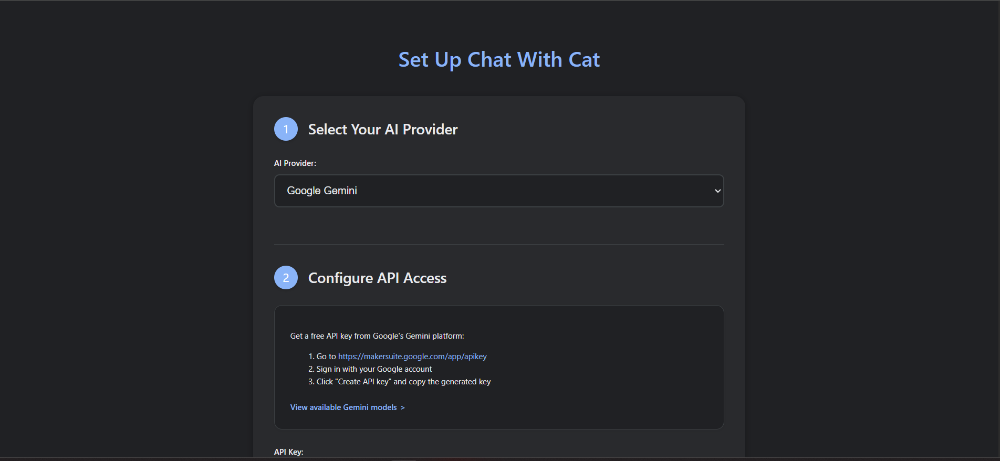
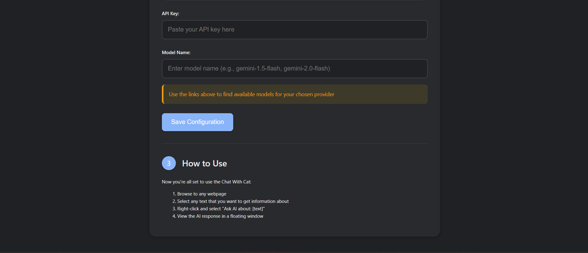
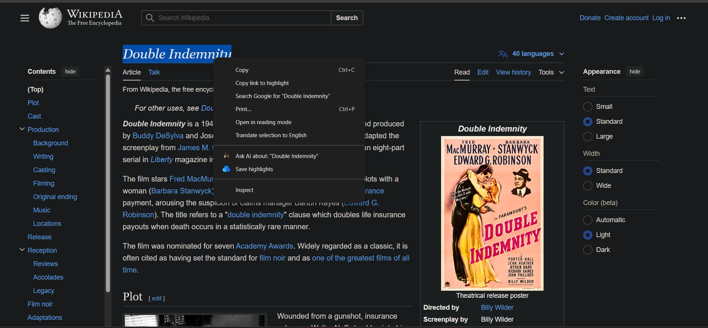
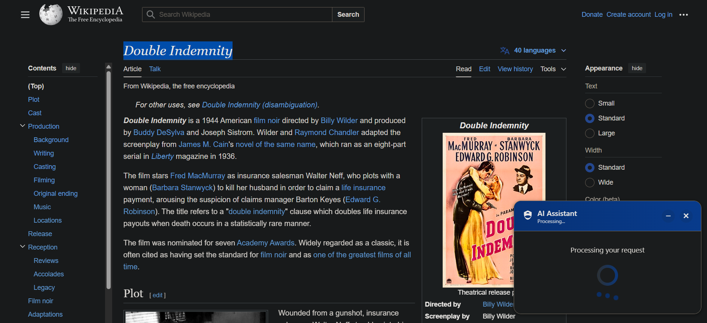
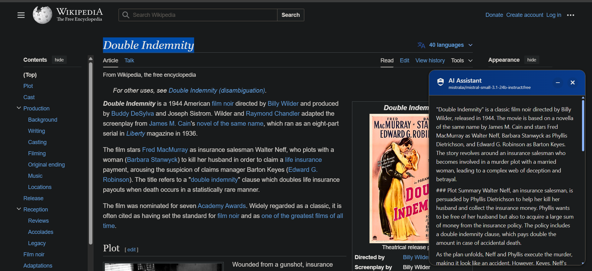

# 🤖 Chat With Cat Chrome Extension

A powerful Chrome extension that provides AI-powered insights about any text you select on a webpage using various AI models like Google Gemini, OpenRouter, and GROQ.

## ✨ Features

- 🔍 Right-click any text to get AI analysis
- 🔄 Support for multiple AI providers:
  - Google Gemini
  - OpenRouter (with free models)
  - GROQ
- 🎨 Beautiful, responsive floating UI
- 🌓 Automatic dark/light mode
- 🖱️ Draggable response window
- 📝 Markdown formatting for responses
- 🔒 Secure local API key storage
- ⚡ Response caching for performance

## 📥 Installation

1. **Clone or download** this repository
   - For safe installation, clone to a protected location like `C:\Projects\`: 
   - `git clone https://github.com/Ns81000/Chat_With_Cat.git C:\Projects\Chat_With_Cat`
   - This prevents accidental deletion that might occur in temporary folders
2. **Get an API key** from one of the supported providers:
   - [Google AI Studio](https://makersuite.google.com/app/apikey) for Gemini
   - [OpenRouter](https://openrouter.ai/keys) for various free models
   - [GROQ Console](https://console.groq.com/keys) for GROQ models
3. **Load the extension in Chrome**:
   - Open Chrome and navigate to `chrome://extensions/`
   - Enable "Developer mode" (toggle in top-right)
   - Click "Load unpacked" and select this extension folder
4. **Configure the extension**:
   - The setup page will automatically open on first install
   - Or click the extension icon anytime to access settings

🤑 **Why DIY?** Because Chrome Web Store's $5 fee is like paying for cat food when your cat prefers the cardboard box! 📦🐱 Skip the fancy packaging and install it yourself - your wallet (and your rebellious inner developer) will thank you! 💸

## 🚀 Usage

1. **Select any text** on a webpage
2. **Right-click** and select "Ask AI about: [text]" 
3. A **floating window** appears with the AI's response
4. **Drag** the window by its header to reposition
5. Use **minimize/close** buttons to control the window

## 🖼️ Screenshots

### Setup Screens



### Response UI




## 🔧 Advanced Configuration

- **Change providers**: Click the extension icon and select a different provider
- **Update API key**: Access settings through the extension icon
- **Change models**: Each provider offers different models with varying capabilities

## 🗂️ Project Structure

```
chrome-extension/
├── manifest.json       # Extension configuration
├── setup.html          # Configuration UI 
├── images/             # Extension icons
│   ├── icon16.png
│   ├── icon48.png
│   └── icon128.png
└── js/
    ├── background.js   # Context menu and API handling
    ├── content.js      # UI injection and display logic
    └── setup.js        # Configuration management
```

## 🔒 Privacy & Security

- All API keys are stored **locally** in your browser storage
- Selected text is sent only to your chosen AI provider
- No data is stored on external servers beyond API processing
- All communication with AI providers uses secure HTTPS

## 🤝 Contributing

Contributions are welcome! Feel free to submit issues or pull requests.

## 📜 License

This project is open source and available under the MIT License.
